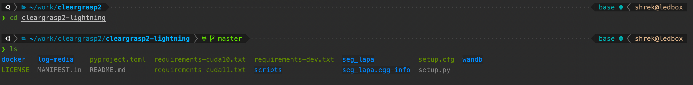
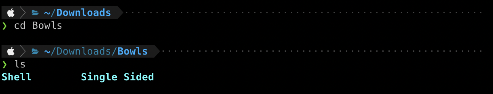

# zsh_setup
Instructions for setting up zsh shell, with oh-my-zsh, powerlevel10k theme and some plugins



# Setting up ZSH
ZSH is an alternative to bash. It has many cool features, plugins and themes.
Example: interactive cd, autocorrection of commands, fuzzy finder, syntax highlighting, etc.

Make sure zsh is installed:
```shell script
$ zsh --version
zsh 5.4.2 (x86_64-ubuntu-linux-gnu)
```

If not, install with:
```shell script
sudo apt install zsh

# Make it default shell
chsh -s $(which zsh)
```

## Install oh-my-zsh
https://github.com/ohmyzsh/ohmyzsh
```shell script
sh -c "$(wget --no-check-certificat -O- https://raw.githubusercontent.com/ohmyzsh/ohmyzsh/master/tools/install.sh)"
```

## Switch to PowerLevel10k theme



```shell
git clone --depth=1 https://gitee.com/romkatv/powerlevel10k.git ${ZSH_CUSTOM:-$HOME/.oh-my-zsh/custom}/themes/powerlevel10k
```

Open `~/.zshrc` and modify the theme:
```shell script
# Set name of the theme to load --- if set to "random", it will
# load a random theme each time oh-my-zsh is loaded, in which case,
# to know which specific one was loaded, run: echo $RANDOM_THEME
# See https://github.com/robbyrussell/oh-my-zsh/wiki/Themes
ZSH_THEME="powerlevel10k/powerlevel10k"
```

Next time the terminal is started the configure wizard should start up. Select the options to customize the look.
To run the wizard again, call:
```shell
p10k configure
```


## Install Plugins

### Standard plugins
Clone the following plugin's repos into oh-my-zsh's plugin directory:
- zsh-syntax-highlighting: https://github.com/zsh-users/zsh-syntax-highlighting
- zsh-autosuggestions: https://github.com/zsh-users/zsh-autosuggestions
- zsh-256color: https://github.com/chrissicool/zsh-256color
- zsh-dircolors-solarized: https://github.com/joel-porquet/zsh-dircolors-solarized

```shell script
git clone https://github.com/zsh-users/zsh-syntax-highlighting.git ${ZSH_CUSTOM:-~/.oh-my-zsh/custom}/plugins/zsh-syntax-highlighting
git clone https://github.com/zsh-users/zsh-autosuggestions ${ZSH_CUSTOM:-~/.oh-my-zsh/custom}/plugins/zsh-autosuggestions
git clone https://github.com/chrissicool/zsh-256color ${ZSH_CUSTOM:-~/.oh-my-zsh/custom}/plugins/zsh-256color
git clone --recursive git://github.com/joel-porquet/zsh-dircolors-solarized $ZSH_CUSTOM/plugins/zsh-dircolors-solarized
```

Within the `~/zshrc` file, search for the line with plugins and add:
```shell script
# Which plugins would you like to load?
# Standard plugins can be found in ~/.oh-my-zsh/plugins/*
# Custom plugins may be added to ~/.oh-my-zsh/custom/plugins/
# Example format: plugins=(rails git textmate ruby lighthouse)
# Add wisely, as too many plugins slow down shell startup.
plugins=(git zsh-autosuggestions zsh-256color zsh-syntax-highlighting zsh-dircolors-solarized)
```

See which dircolor schemes are available:
```shell script
lssolarized
```
Set the "ansi-dark" dircolor scheme:
```shell script
setupsolarized dircolors.256dark
```


### Fuzzy finder
https://github.com/junegunn/fzf
```shell script
git clone --depth 1 https://github.com/junegunn/fzf.git ~/.fzf
~/.fzf/install
```

Running install will add the following lines to `.zshrc`:
```shell script
# Fuzzy Finder
 [ -f ~/.fzf.zsh ] && source ~/.fzf.zsh
```

## Configure ZSH params
Open `~/.zshrc` (zsh config file) and add the below lines. If they already exist, modify them:

```shell script
# Large history file
HISTSIZE=10000000
SAVEHIST=10000000

# Prevent duplicates in history
setopt hist_ignore_all_dups hist_save_nodups

# Um... colors?
# eval `dircolors ~/.dir_colors/dircolors` - This is not the default location of dircolors on ubuntu. Causes errors.
ZSH_AUTOSUGGEST_HIGHLIGHT_STYLE='fg=250'

# interactive cd
function cd() {
    if [[ "$#" != 0 ]]; then
        builtin cd "$@";
        return
    fi
    while true; do
        local lsd=$(echo ".." && ls -p | grep '/$' | sed 's;/$;;')
        local dir="$(printf '%s\n' "${lsd[@]}" |
            fzf --reverse --preview '
                __cd_nxt="$(echo {})";
                __cd_path="$(echo $(pwd)/${__cd_nxt} | sed "s;//;/;")";
                echo $__cd_path;
                echo;
                ls -p --color=always "${__cd_path}";
        ')"
        [[ ${#dir} != 0 ]] || return 0
        builtin cd "$dir" &> /dev/null
    done
}

# Sorts issues with tmux
export LC_CTYPE=en_US.UTF-8

# Set the autocomplete color (chosen: purple)
# Ref for colors: https://coderwall.com/p/pb1uzq/z-shell-colors
ZSH_AUTOSUGGEST_HIGHLIGHT_STYLE='fg=62'

# set the zsh no-match behavior is the same as bash (for glob patterns to scp and the like)
setopt nonomatch
```

## Init conda
If using anaconda to manage python environments, init it so you can access `conda` from zsh:
```shell script
conda init zsh
```

