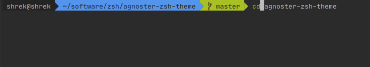

# zsh_setup
Instructions for setting up zsh shell, with oh-my-zsh and some plugins


# Setting up ZSH

## Install oh-my-zsh
```shell script
sh -c "$(wget --no-check-certificat -O- https://raw.githubusercontent.com/ohmyzsh/ohmyzsh/master/tools/install.sh)"
```


## Install Plugins
Within the `~/zshrc` file, search for the line with plugins and add:
```shell script
# Which plugins would you like to load?
# Standard plugins can be found in ~/.oh-my-zsh/plugins/*
# Custom plugins may be added to ~/.oh-my-zsh/custom/plugins/
# Example format: plugins=(rails git textmate ruby lighthouse)
# Add wisely, as too many plugins slow down shell startup.
plugins=(git zsh-autosuggestions zsh-256color)
```

### Fuzzy finder
https://github.com/junegunn/fzf
```shell script
git clone --depth 1 https://github.com/junegunn/fzf.git ~/.fzf
~/.fzf/install
```

Running install will add the following lines to `.zshrc`:
```shell script
# Fuzzy Finder
 [ -f ~/.fzf.zsh ] && source ~/.fzf.zsh
```

### zsh syntax highlighting
https://github.com/zsh-users/zsh-syntax-highlighting
```shell script
mkdir -p ~/software/zsh
cd ~/software/zsh
git clone git@github.com:zsh-users/zsh-syntax-highlighting.git
```

### zsh autosuggestions
https://github.com/zsh-users/zsh-autosuggestions/blob/master/
```shell script
git clone https://github.com/zsh-users/zsh-autosuggestions ${ZSH_CUSTOM:-~/.oh-my-zsh/custom}/plugins/zsh-autosuggestions
```

### zsh-256color
https://github.com/chrissicool/zsh-256color
```shell script
git clone git@github.com:chrissicool/zsh-256color.git ${ZSH_CUSTOM:-~/.oh-my-zsh/custom}/plugins/zsh-256color
```

## Modify ZSH theme
Open `~/.zshrc` and modify the theme:
```shell script
# Set name of the theme to load --- if set to "random", it will
# load a random theme each time oh-my-zsh is loaded, in which case,
# to know which specific one was loaded, run: echo $RANDOM_THEME
# See https://github.com/robbyrussell/oh-my-zsh/wiki/Themes
ZSH_THEME="agnoster"
```


## Configure ZSH params
The config file for zsh is at `~/.zshrc`. Open the file and add the below lines. If they already exist, modify them:

```shell script
# Large history file
HISTSIZE=10000000
SAVEHIST=10000000

# Prevent duplicates in history
setopt hist_ignore_all_dups hist_save_nodups

# Um... colors?
eval `dircolors ~/.dir_colors/dircolors`
ZSH_AUTOSUGGEST_HIGHLIGHT_STYLE='fg=250'

# interactive cd
function cd() {
    if [[ "$#" != 0 ]]; then
        builtin cd "$@";
        return
    fi
    while true; do
        local lsd=$(echo ".." && ls -p | grep '/$' | sed 's;/$;;')
        local dir="$(printf '%s\n' "${lsd[@]}" |
            fzf --reverse --preview '
                __cd_nxt="$(echo {})";
                __cd_path="$(echo $(pwd)/${__cd_nxt} | sed "s;//;/;")";
                echo $__cd_path;
                echo;
                ls -p --color=always "${__cd_path}";
        ')"
        [[ ${#dir} != 0 ]] || return 0
        builtin cd "$dir" &> /dev/null
    done
}

# Sorts issues with tmux
export LC_CTYPE=en_US.UTF-8
```

## Init conda
If using anaconda to manage python environments, init it so you can access `conda` from zsh:
```shell script
conda init zsh
```

## (Optional) Update agnoster theme
The agnoster theme was meant for a solaris color scheme. If your terminal
uses a black background, the name of the directories can be hard to read.
I updated the agnoster theme so that the name of directories was white instead of black.
Download it here: https://github.com/Shreeyak/agnoster-zsh-theme
```shell script
git clone git@github.com:Shreeyak/agnoster-zsh-theme.git
cp ~/.oh-my-zsh/themes/agnoster.zsh-theme ~/.oh-my-zsh/themes/agnoster.zsh-theme.bak
cp agnoster-zsh-theme/agnoster.zsh-theme ~/.oh-my-zsh/themes/agnoster.zsh-theme
```

